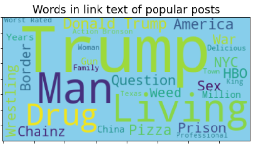
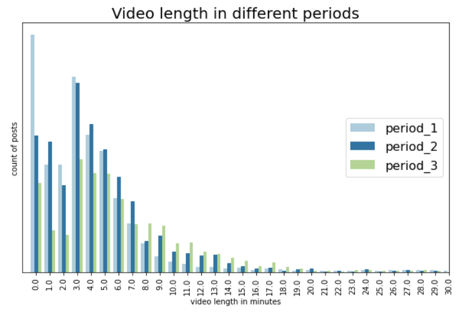

# Data Analysis of Facebook records

## by Kamila Hamalcikova

Words and word combinations appearing on very popular FB posts for VICE FB pages, source: Kamila Hamalcikova

## Dataset

Facebook records for **posts with videos from 26/05/2018 to 25/0/2021 for FB pages of the company VICE**. Data include standard FB variables like Total views, number of likes, comments, reactions (love, haha, angry etc.), length of videos, number of crossposts and original posts, name of sponsors for sponsored posts. In total data is available for almost **18 500 unique FB posts** of VICE.

## Installation

- Anaconda
- Jupyter Notebook
- Python 3.6
- Python libraries (Pandas, Numpy, Matplotlib, Seaborn, Wordcloud)

## Main findings

The main goal of the data analysis was to find shift in content strategy on Facebook of VICE over period of 3 years. I found out that:

- **Number of posts in total decreased over time**, while number of crossposts (content from other FB pages) decreased and number of original posts increased (at least in last 2 years), even though majority of posts still remained crossposts.
- **Length of videos increased** over time. (On average from 4,5 minutes in first period to 7 minutes of video in last period)
- **Average total views for posts went up**, therefore we can conclude content strategy improved.
- **The most popular posts** in terms of total interactions usually had **higher ratio of haha reactions**.
- **Angry reaction** did not appear a lot on the best and the worst posts in terms of total interactions. On other hand they did appear **more often on "mediocre" posts** (middle on scale of total interactions).

For business users data is presented in a form of powerpoint presentation, leaving out all code and focalising only on main findings.

source: Kamila Hamalcikova

## License

This project is licensed under the MIT License - see the [license](https://opensource.org/licenses/MIT) file for details
